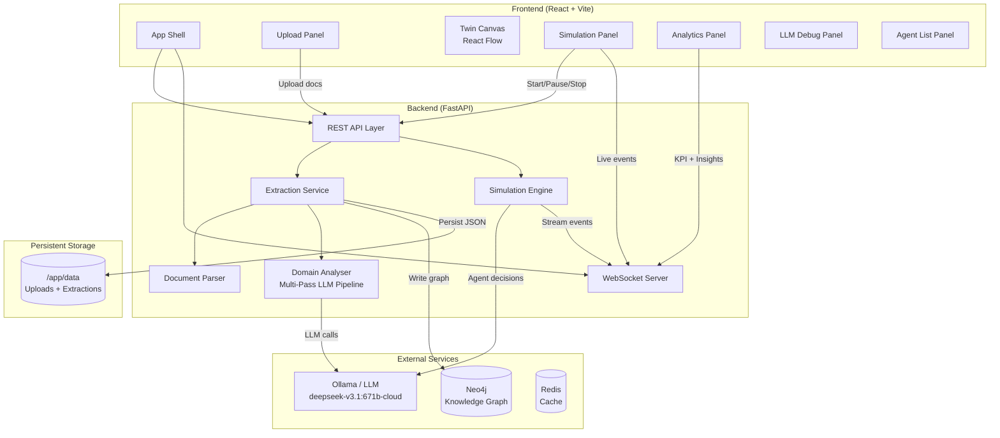
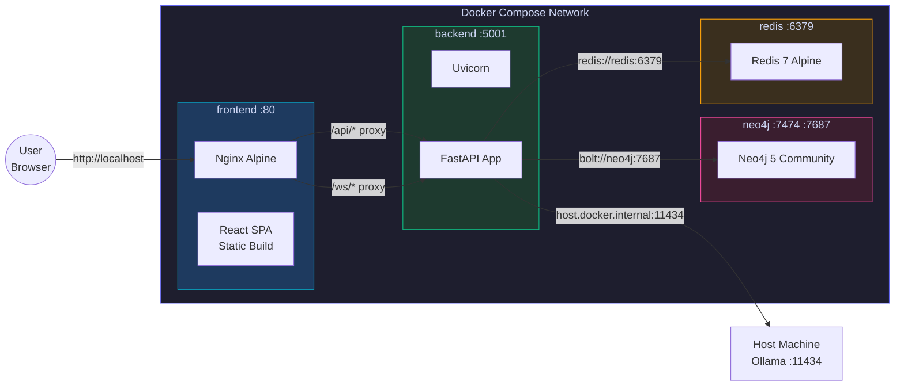
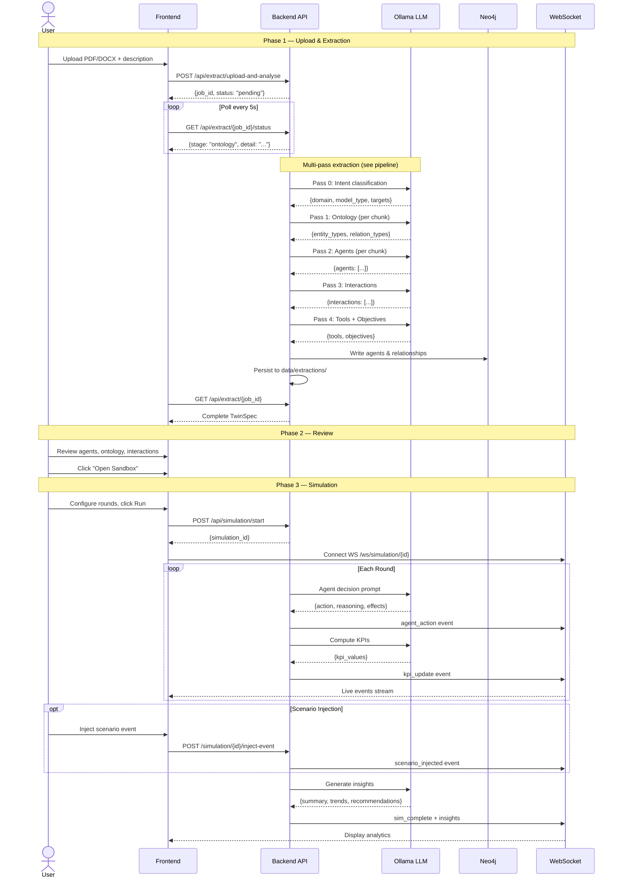
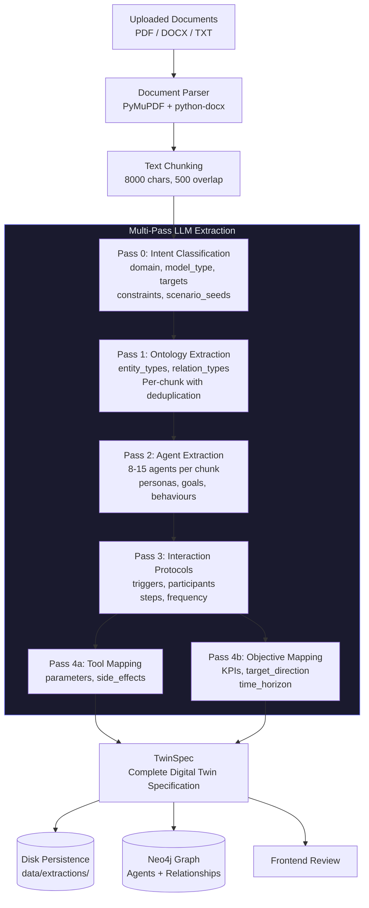
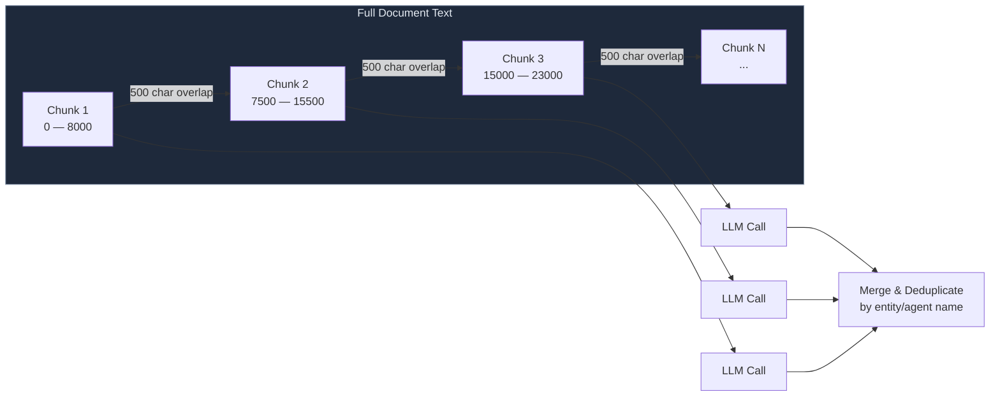
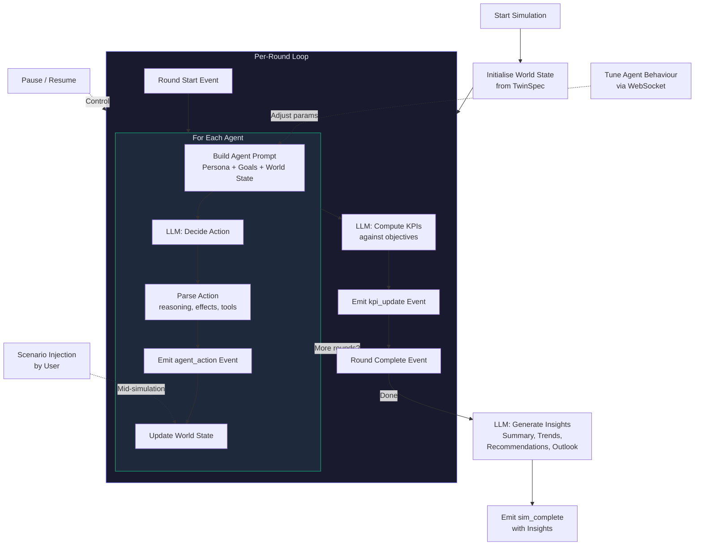
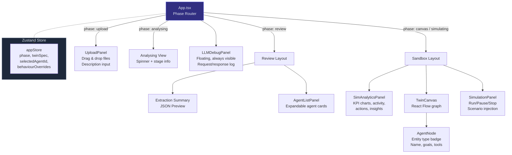
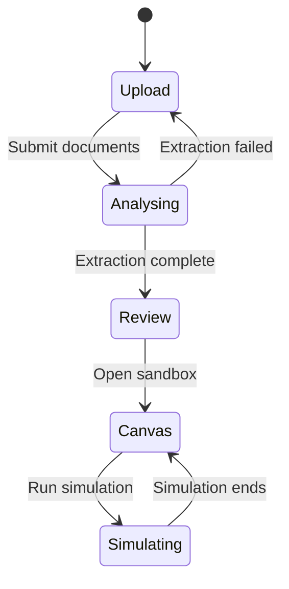

# WeaveX — AI-Powered Digital Twin Platform

WeaveX is an AI-powered digital twin builder. Upload PDF, DOCX, or text documents describing a domain, and the platform uses LLM-driven extraction to automatically discover agents, relationships, interaction protocols, tools, and KPI objectives. The extracted digital twin can then be visualised on an interactive canvas and run through multi-agent simulations with real-time analytics, scenario injection, and post-simulation insights.

---

## Table of Contents

- [Architecture Overview](#architecture-overview)
- [Container Structure](#container-structure)
- [End-to-End Workflow](#end-to-end-workflow)
- [LLM Extraction Pipeline](#llm-extraction-pipeline)
- [Simulation Engine](#simulation-engine)
- [Data Flow](#data-flow)
- [Frontend Component Tree](#frontend-component-tree)
- [API Reference](#api-reference)
- [Tech Stack](#tech-stack)
- [Getting Started](#getting-started)
- [Configuration](#configuration)
- [Project Structure](#project-structure)

---

## Architecture Overview



---

## Container Structure



| Container | Image | Port | Role |
|-----------|-------|------|------|
| `frontend` | Node 20 build + Nginx Alpine | 80 | Serves React SPA, proxies API/WS to backend |
| `backend` | Python 3.12-slim | 5001 | FastAPI server, LLM pipeline, simulation engine |
| `neo4j` | Neo4j 5 Community | 7474, 7687 | Knowledge graph storage for agents & relationships |
| `redis` | Redis 7 Alpine | 6379 | Cache and pub/sub (future use) |

---

## End-to-End Workflow



---

## LLM Extraction Pipeline

The domain analyser processes uploaded documents through a multi-pass LLM pipeline. Documents are split into overlapping chunks (8,000 chars with 500 char overlap) to ensure full coverage.



### Chunking Strategy



---

## Simulation Engine



### Simulation Controls

| Action | Endpoint | Description |
|--------|----------|-------------|
| Start | `POST /api/simulation/start` | Begin simulation with extraction data |
| Pause | `POST /api/simulation/{id}/pause` | Pause after current round |
| Resume | `POST /api/simulation/{id}/resume` | Resume paused simulation |
| Stop | `POST /api/simulation/{id}/stop` | Stop simulation immediately |
| Inject | `POST /api/simulation/{id}/inject-event` | Inject a scenario mid-run |

### WebSocket Event Types

| Event | Direction | Payload |
|-------|-----------|---------|
| `sim_started` | Server → Client | `total_rounds` |
| `round_start` | Server → Client | `round` number |
| `agent_action` | Server → Client | `agent_name`, `action`, `reasoning`, `effects` |
| `kpi_update` | Server → Client | `kpis: {name: value}` |
| `round_complete` | Server → Client | `world_state` snapshot |
| `scenario_injected` | Server → Client | `event` description |
| `sim_complete` | Server → Client | `insights` (summary, trends, recommendations) |
| `tune_behaviour` | Client → Server | `agent_id`, `params` |
| `inject_event` | Client → Server | `event` description |

---

## Data Flow

```mermaid
flowchart LR
    subgraph Input
        PDF[PDF]
        DOCX[DOCX]
        TXT[TXT / MD / CSV]
    end

    subgraph Extraction["Extraction Pipeline"]
        PARSE[Parse Documents]
        CHUNK[Chunk Text]
        LLM_EX[LLM Multi-Pass<br/>Extraction]
    end

    subgraph TwinSpec["TwinSpec Output"]
        INT[IntentSpec<br/>domain, model_type, targets]
        ONT[Ontology<br/>entity_types, relation_types]
        AGT[AgentSpec[N]<br/>persona, goals, behaviour]
        IPR[InteractionProtocol[N]<br/>trigger, steps, frequency]
        TLS[ToolSpec[N]<br/>params, side_effects]
        OBJ[ObjectiveSpec[N]<br/>kpi, direction, time_horizon]
    end

    subgraph Persistence
        DISK[(JSON on Disk)]
        NEO[(Neo4j Graph)]
    end

    subgraph Simulation
        ENG[Simulation Engine]
        KPI[KPI Charts]
        INS[Insights &<br/>Recommendations]
    end

    PDF & DOCX & TXT --> PARSE --> CHUNK --> LLM_EX
    LLM_EX --> INT & ONT & AGT & IPR & TLS & OBJ
    AGT --> DISK & NEO
    INT & ONT & AGT & IPR & TLS & OBJ --> ENG
    ENG --> KPI & INS
```

---

## Frontend Component Tree



### Application Phases



---

## API Reference

### Extraction

| Method | Path | Description |
|--------|------|-------------|
| `POST` | `/api/extract/upload-and-analyse` | Upload files + start extraction job |
| `POST` | `/api/extract/analyse-text` | Analyse raw text input |
| `GET` | `/api/extract/list` | List all completed extractions |
| `GET` | `/api/extract/{job_id}/status` | Poll extraction progress |
| `GET` | `/api/extract/{job_id}` | Get completed extraction result |

### Simulation

| Method | Path | Description |
|--------|------|-------------|
| `POST` | `/api/simulation/start` | Start a new simulation |
| `POST` | `/api/simulation/{id}/pause` | Pause running simulation |
| `POST` | `/api/simulation/{id}/resume` | Resume paused simulation |
| `POST` | `/api/simulation/{id}/stop` | Stop simulation |
| `POST` | `/api/simulation/{id}/inject-event` | Inject scenario event |
| `GET` | `/api/simulation/{id}/status` | Get simulation state |
| `GET` | `/api/simulation/{id}/log` | Get event log (last 100) |

### Projects

| Method | Path | Description |
|--------|------|-------------|
| `POST` | `/api/projects/` | Create project |
| `GET` | `/api/projects/` | List projects |
| `GET` | `/api/projects/{id}` | Get project |
| `DELETE` | `/api/projects/{id}` | Delete project |

### Debug & Health

| Method | Path | Description |
|--------|------|-------------|
| `GET` | `/health` | API health check |
| `GET` | `/api/debug/llm-log` | Last 50 LLM request/response events |
| `WS` | `/ws/simulation/{id}` | Real-time simulation event stream |

---

## Tech Stack

| Layer | Technology |
|-------|------------|
| Frontend | React 19, TypeScript, Vite 6, TailwindCSS 4 |
| State Management | Zustand |
| Graph Visualisation | React Flow (@xyflow/react) |
| Charts | Recharts |
| Backend | Python 3.12, FastAPI, Uvicorn |
| LLM | Ollama (OpenAI-compatible API) |
| Knowledge Graph | Neo4j 5 |
| Cache | Redis 7 |
| Document Parsing | PyMuPDF, python-docx |
| Data Validation | Pydantic v2 |
| Containerisation | Docker, Docker Compose |

---

## Getting Started

### Prerequisites

- [Docker](https://docs.docker.com/get-docker/) and Docker Compose
- [Ollama](https://ollama.ai/) running on the host machine
- An Ollama model pulled (e.g. `ollama pull deepseek-v3.1:671b-cloud` or `ollama pull gemma4:latest`)

### Run with Docker Compose

```bash
cd digitwin

# Start all services (builds on first run)
docker compose up --build -d

# Check status
docker compose ps
```

The platform will be available at **http://localhost**.

| Service | URL |
|---------|-----|
| Frontend | http://localhost |
| Backend API | http://localhost:5001 |
| API Docs (Swagger) | http://localhost:5001/docs |
| Neo4j Browser | http://localhost:7474 |

### Run for Development

```bash
cd digitwin

# Start infrastructure only
docker compose up -d neo4j redis

# Backend
cd backend
python -m venv .venv
source .venv/bin/activate  # or .venv\Scripts\activate on Windows
pip install -r requirements.txt
uvicorn app.main:app --host 0.0.0.0 --port 5001

# Frontend (separate terminal)
cd frontend
npm install
npm run dev
```

Development frontend runs at **http://localhost:5173** with API proxy to the backend.

---

## Configuration

All backend configuration is via environment variables (see `backend/.env`):

| Variable | Default | Description |
|----------|---------|-------------|
| `LLM_BASE_URL` | `http://localhost:11434/v1` | Ollama API endpoint |
| `LLM_MODEL` | `gemma4:26b` | LLM model name |
| `LLM_API_KEY` | `ollama` | API key (Ollama ignores this) |
| `NEO4J_URI` | `bolt://localhost:7687` | Neo4j connection URI |
| `NEO4J_USER` | `neo4j` | Neo4j username |
| `NEO4J_PASSWORD` | `digitwin_dev` | Neo4j password |
| `REDIS_URL` | `redis://localhost:6379/0` | Redis connection URL |
| `UPLOAD_DIR` | `./data/uploads` | File upload directory |
| `PORT` | `5001` | Backend server port |
| `CORS_ORIGINS` | `http://localhost:5173` | Allowed CORS origins |

When running in Docker, the compose file overrides `NEO4J_URI`, `REDIS_URL`, `OLLAMA_BASE_URL`, and `LLM_BASE_URL` to use container networking and `host.docker.internal`.

---

## Project Structure

```
digitwin/
├── docker-compose.yml              # All 4 services
│
├── backend/
│   ├── Dockerfile
│   ├── .dockerignore
│   ├── .env                        # Environment config
│   ├── requirements.txt
│   └── app/
│       ├── main.py                 # FastAPI entry point
│       ├── config.py               # Pydantic settings
│       ├── api/
│       │   ├── extraction.py       # Document upload & analysis
│       │   ├── simulation.py       # Simulation control
│       │   ├── websocket.py        # Real-time event streaming
│       │   ├── projects.py         # Project CRUD
│       │   └── debug.py            # LLM request/response log
│       ├── services/
│       │   ├── extractors/
│       │   │   ├── document_parser.py   # PDF/DOCX/TXT parsing
│       │   │   └── domain_analyser.py   # Multi-pass LLM pipeline
│       │   └── simulation/
│       │       └── engine.py            # Multi-agent simulation
│       ├── models/
│       │   └── twin_spec.py        # Pydantic data models
│       └── utils/
│           ├── llm_client.py       # Ollama / OpenAI client
│           └── graph_client.py     # Neo4j async client
│
├── frontend/
│   ├── Dockerfile
│   ├── .dockerignore
│   ├── nginx.conf                  # Reverse proxy config
│   ├── package.json
│   ├── vite.config.ts
│   └── src/
│       ├── App.tsx                  # Root component & phase router
│       ├── main.tsx                 # React entry point
│       ├── api/
│       │   └── client.ts           # Axios HTTP + polling helpers
│       ├── stores/
│       │   └── appStore.ts         # Zustand global state
│       ├── types/
│       │   └── index.ts            # TypeScript interfaces
│       └── components/
│           ├── canvas/
│           │   ├── TwinCanvas.tsx   # React Flow agent graph
│           │   └── AgentNode.tsx    # Agent node component
│           └── panels/
│               ├── UploadPanel.tsx       # File upload UI
│               ├── AgentListPanel.tsx    # Agent sidebar
│               ├── AgentPanel.tsx        # Agent detail view
│               ├── SimulationPanel.tsx   # Simulation controls
│               ├── SimAnalyticsPanel.tsx # KPI charts & insights
│               └── LLMDebugPanel.tsx     # LLM debug overlay
│
└── scripts/
    └── seed_test.py                # E2E pipeline smoke test
```
